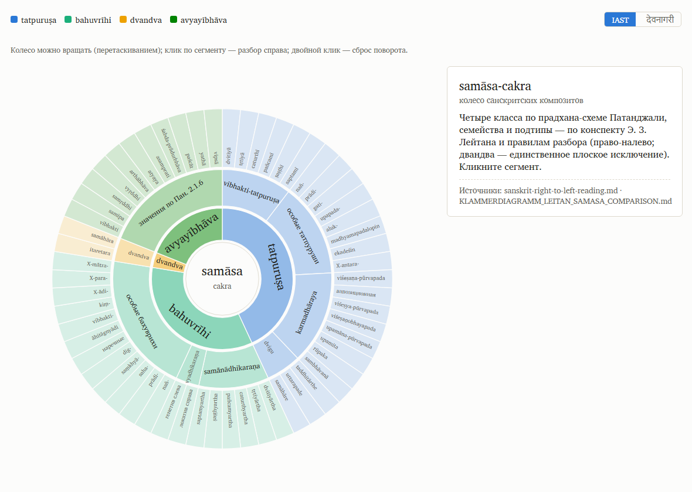

# SamasaChakram

_Created: 11-07-2026 · Last updated: 16-07-2026_

> **Status: live.** The samāsa programme consolidated here 16-07-2026 (H1010) from
> claude-config: the /klammerdiagramm drawing system, its worked-example gallery,
> the shared right-to-left reading method, and the Leitan conspectus crosswalk.

## The wheel

**Live:** [gasyoun.github.io/SamasaChakram](https://gasyoun.github.io/SamasaChakram/) —
the wheel on GitHub Pages. **Interactive source:** [samasacakra/samasacakra-wheel.html](https://github.com/gasyoun/SamasaChakram/blob/main/samasacakra/samasacakra-wheel.html)
(same page, open locally — drag to rotate, click a segment for the vigraha + Russian gloss — thirteen
leaves embed their Klammerdiagramm from the gallery right in the panel — every drawn
gallery compound is now reachable from the wheel, and every
leaf links to the gallery; double-click to reset; **IAST ⇄ Devanāgarī script toggle**, embedded Klammer Serif + Klammer Deva
(an OFL-renamed Noto Serif Devanagari subset — licence bundled), light/dark themes). **Print/poster export:** [samasacakra/samasacakra-poster.pdf](https://github.com/gasyoun/SamasaChakram/blob/main/samasacakra/samasacakra-poster.pdf)
— a single A2 sheet (420×594 mm): dual-script title, the wheel full-width, and the complete
58-subtype index in four class columns (term — example in both scripts — RU gloss), with
the pradhāna line and MG structure rule heading each class. Built by
[samasacakra/build_samasacakra.py](https://github.com/gasyoun/SamasaChakram/blob/main/samasacakra/build_samasacakra.py)
from [samasacakra/samasacakra-taxonomy.json](https://github.com/gasyoun/SamasaChakram/blob/main/samasacakra/samasacakra-taxonomy.json) —
4 classes (Patañjali's pradhāna scheme) · 10 families · 58 leaf subtypes, each with a
canonical example from the Leitan conspectus; the MG structural rulings (right-to-left law,
dvandva the sole flat exception, D1–D6) annotated per class and leaf.

## Contents

| Path | What it is |
|---|---|
| [sanskrit-right-to-left-reading.md](https://github.com/gasyoun/SamasaChakram/blob/main/sanskrit-right-to-left-reading.md) | the canonical right-to-left (head-first) reading method + all MG samāsa-direction rulings; shared source for the `/sanskrit-parse`, `/klammeruebersetzung` and `/klammerdiagramm` skills (which live in [claude-config](https://github.com/gasyoun/claude-config)) |
| [klammerdiagramm-worked-examples.md](https://github.com/gasyoun/SamasaChakram/blob/main/klammerdiagramm-worked-examples.md) | the illustrated gallery — eleven compounds from the 2-lemma pair to the all-five-kinds capstone, each with diagram, config and what its run proved |
| [KLAMMERDIAGRAMM_LEITAN_SAMASA_COMPARISON.md](https://github.com/gasyoun/SamasaChakram/blob/main/KLAMMERDIAGRAMM_LEITAN_SAMASA_COMPARISON.md) | the H982 crosswalk of the drawing system against Э. З. Лейтан's samāsa conspectus, with the six voted rulings (D1–D6) applied |
| [klammerdiagramm/](https://github.com/gasyoun/SamasaChakram/tree/main/klammerdiagramm) | the generator ([build_klammerdiagramm.py](https://github.com/gasyoun/SamasaChakram/blob/main/klammerdiagramm/build_klammerdiagramm.py)), the OFL-renamed Charis 7.000 subset + licence, the printed reference plate, and every worked diagram (config JSON + SVG + embedded-font HTML + PNG) |
| [samasacakra/](https://github.com/gasyoun/SamasaChakram/tree/main/samasacakra) | the samāsa-cakra wheel itself — taxonomy JSON, generator, SVG/HTML/PNG (H1016) |
| [leitan/](https://github.com/gasyoun/SamasaChakram/tree/main/leitan) | pinned text export of Э. З. Лейтан, «Сложные слова в санскрите» (from MG's «Общество ревнителей санскрита» webinar; publication here authorized by MG 16-07-2026) |

## What this is

*Samāsa Cakra* ("the wheel of compounds") is a traditional Sanskrit pedagogical
device: a chart, arranged as a wheel, used to teach the classification and
analysis of Sanskrit nominal compounds (*samāsa*) — the six classical groups
(*avyayībhāva*, *tatpuruṣa* incl. *karmadhāraya*, *dvigu*, *bahuvrīhi*,
*dvandva*) and the resolution (*vigraha*) of a compound into its members.

This repo — per its one-line description, "Samasa Chakram reinvented" — is
intended as a modern, digital reinvention of that device: an interactive tool
for exploring and analysing Sanskrit compounds. **That work has not started
yet.** The repository was created on 18-04-2026 and so far contains only the
standard org baseline (see below).

## Current contents

| Path | Purpose |
|---|---|
| [`LICENSE`](https://github.com/gasyoun/SamasaChakram/blob/main/LICENSE) | Apache License 2.0 |
| [`.github/dependabot.yml`](https://github.com/gasyoun/SamasaChakram/blob/main/.github/dependabot.yml) | Weekly Dependabot updates for GitHub Actions |
| [`.github/workflows/dependabot-auto-merge.yml`](https://github.com/gasyoun/SamasaChakram/blob/main/.github/workflows/dependabot-auto-merge.yml) | Hands-off auto-merge of passing Dependabot PRs |

No source code, data, or documentation beyond this file is present yet.

## Project context

SamasaChakram is one of the [Sanskrit Lexicon / `gasyoun`](https://github.com/gasyoun)
research repositories (Tier 2 — other research). It is not yet wired into any
cross-repo pipeline or dataset in
[`Uprava/PROJECT_INTERLINKS.md`](https://github.com/gasyoun/Uprava/blob/main/PROJECT_INTERLINKS.md),
and has no entry in the paper pipeline
([`Uprava/ARTICLES.md`](https://github.com/gasyoun/Uprava/blob/main/ARTICLES.md)).

## Status / next steps

There is no roadmap document, `.ai_state.md`, or handoff for this repository yet.
When development begins, this section should be replaced with a concrete scope,
a data/implementation inventory, and a link to a dated roadmap. Until then, treat
this repository as reserved for the planned *samāsa*-analysis tool.

## License

Licensed under the [Apache License 2.0](https://github.com/gasyoun/SamasaChakram/blob/main/LICENSE).

_Dr. Mārcis Gasūns_
