_Created: 15-07-2026 · Last updated: 16-07-2026 (rev 12 — §11 ghost-member notation added per the corrected D4 vote; rev 11 recut §1 to Leitan per D5/H997)_

# Klammerdiagramm — worked examples (compounds the skill has been tested on)

The gallery of every compound
[/klammerdiagramm](https://github.com/gasyoun/claude-config/blob/main/commands/klammerdiagramm.md)
has actually been run on, with the rendered diagrams, the configs that produced them, and
what each run proved or fixed. **"Long" and "short" count members (lemmas combined), never
letters:** *abhijñāna-śākuntalam* below is a twenty-letter word but a *short* compound —
two lemmas, one node; the uddāma word is *long* because it combines eight lemmas into a
seven-node staircase. Diagram complexity scales with the lemma count alone. Generator:
[build_klammerdiagramm.py](https://github.com/gasyoun/SamasaChakram/blob/main/klammerdiagramm/build_klammerdiagramm.py)
(tight-run measured layout — x positions derived from Charis advance widths; method:
[sanskrit-right-to-left-reading.md](https://github.com/gasyoun/SamasaChakram/blob/main/sanskrit-right-to-left-reading.md)
§ *Publication-grade form*). Every render is also committed as a self-contained HTML with
the embedded "Klammer Serif" (Charis 7.000 subset, SIL OFL) — 1:1 on machines with no font
installed.

## 1 · uddāma-ajñāna-rūpa-prabalatama-tamaḥ-stoma-soma-svabhāvā- (8 members)

The founding example. **Canonical constituency updated 16-07-2026 (MG vote D5, H997):** the
compound is now drawn in **E. Leitan's reading** — the `{uddāma-ajñāna-rūpa}` block ("whose
form is boundless ignorance": `uddāma-ajñāna` = boundless ignorance, then `rūpa`) joins the
right-branching `prabalatama-tamaḥ-stoma-soma-svabhāvā` tail at the outermost node, with the
**I/II часть ‖-mark before `svabhāvā`** (the ultimate head). This supersedes the printed
plate's pure right-branching chain (split at `tamaḥ`), which stays fully preserved and
reproducible as the *historical* reading below — nothing signed off was discarded.

The canonical render (Leitan's constituency, v0.1.30):

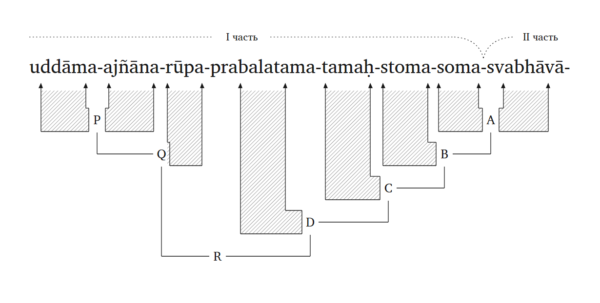

- Files: [SVG](https://github.com/gasyoun/SamasaChakram/blob/main/klammerdiagramm/klammerdiagramm-uddama-example.svg) ·
  [embedded-font HTML](https://github.com/gasyoun/SamasaChakram/blob/main/klammerdiagramm/klammerdiagramm-uddama-example.html) ·
  [config JSON](https://github.com/gasyoun/SamasaChakram/blob/main/klammerdiagramm/klammerdiagramm-uddama-leitan.json)
- Analysis: a two-branch tree. **Left block** — `P = uddāma+ajñāna` (∪, "boundless
  ignorance"), `Q = [P]+rūpa` (mirrored, the braced block). **Right tail** — `A = soma+svabhāvā`,
  `B = stoma+[A]`, `C = tamaḥ+[B]`, `D = prabalatama+[C]`. **Top** — `R = [Q]+[D]` (directed
  join, head = the tail). **II часть begins at `svabhāvā`** (asked). The ‖-mark is a
  reading-aid annotation, independent of the binary nesting — exactly as the plate's mark sat
  mid-chain at `tamaḥ`.
- Config: the generator's built-in `DEFAULT_CONFIG` (no `--config` needed) now encodes this
  reading; the same JSON is also committed as
  [klammerdiagramm-uddama-leitan.json](https://github.com/gasyoun/SamasaChakram/blob/main/klammerdiagramm/klammerdiagramm-uddama-leitan.json).
- What this run proved: the block-and-tail join (two ∪ pairs on one rung, a mirrored bracket,
  a directed join) draws zero-code from the existing grammar — a fresh (non-plate-reproduction)
  drawing, judgment-gated, not a 1:1 trace.

**Historical — the MG-signed-off printed plate (🟢 1:1, 15-07-2026), superseded reading.**
The original plate (recovered from the H814 session transcript, committed v0.1.13) and its
faithful right-branching render (chain **A–G**, `A = soma+svabhāvā`, II часть at `tamaḥ`)
remain the geometry-calibration reference and are reproducible via
[klammerdiagramm-uddama-plate-historical.json](https://github.com/gasyoun/SamasaChakram/blob/main/klammerdiagramm/klammerdiagramm-uddama-plate-historical.json):

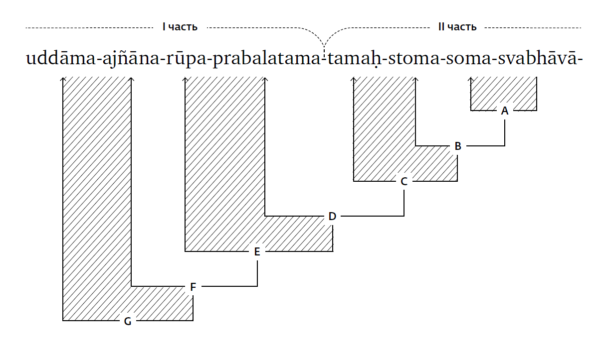

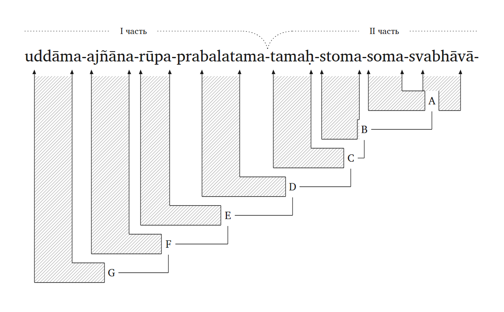

- Files: [plate scan PNG](https://github.com/gasyoun/SamasaChakram/blob/main/klammerdiagramm/klammerdiagramm-target-plate.png) ·
  [historical SVG](https://github.com/gasyoun/SamasaChakram/blob/main/klammerdiagramm/klammerdiagramm-uddama-plate-historical.svg) ·
  [historical HTML](https://github.com/gasyoun/SamasaChakram/blob/main/klammerdiagramm/klammerdiagramm-uddama-plate-historical.html)

## 2 · abhijñāna-śākuntalam (2 members)

The short case — two lemmas combined (for all its twenty letters): Kālidāsa's title
compound, first non-plate run (v0.1.15, 15-07-2026).

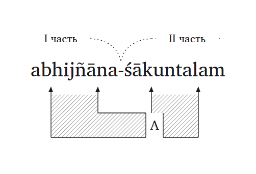

- Files: [SVG](https://github.com/gasyoun/SamasaChakram/blob/main/klammerdiagramm/klammerdiagramm-abhijnanasakuntalam-example.svg) ·
  [embedded-font HTML](https://github.com/gasyoun/SamasaChakram/blob/main/klammerdiagramm/klammerdiagramm-abhijnanasakuntalam-example.html) ·
  [config JSON](https://github.com/gasyoun/SamasaChakram/blob/main/klammerdiagramm/klammerdiagramm-abhijnanasakuntalam.json)
- Analysis: with two members the right-branching staircase collapses to the single deepest
  node — one ∪-bracket **A** = `abhijñāna + śākuntalam` (the same analysis as
  [/klammeruebersetzung](https://github.com/gasyoun/claude-config/blob/main/commands/klammeruebersetzung.md)'s
  worked reference, whose vigraha unpacks the dvandva *abhijñānam ca śākuntalā ca* behind
  the first member). **II часть begins at `śākuntalam`** (asked — degenerate but confirmed).
  Full-title form: `"trailing_hyphen": false`, no quoted-stem hyphen.
- What this run fixed: the hardcoded trailing hyphen became the `trailing_hyphen` config
  key, and the HTML wrapper now displays small diagrams at their natural viewBox size
  instead of inflating them to container width.

## 3 · rāja-ṛṣi-vaṃśaḥ (3 members, LEFT-nested)

The first compound where the right-branching default does **not** hold — and the run that
taught the generator mirrored nodes (v0.1.18, 15-07-2026). Standard analysis: `rāja + ṛṣi`
fuse first (deepest node **A** — *rājarṣi*, the king-sage), and only then take the head:
**B** = `[A] + vaṃśaḥ` — «the lineage of royal sages». The nesting was ASKED and confirmed
(right-branching *rāja-(ṛṣi-vaṃśaḥ)* — «the king's sage-lineage» — is grammatically
possible but semantically the weaker reading).

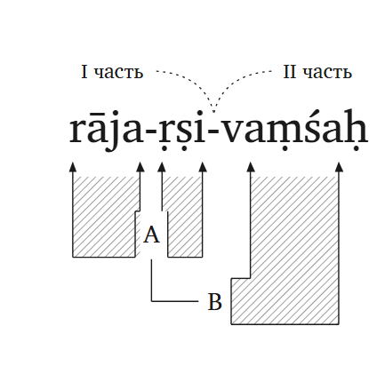

- Files: [SVG](https://github.com/gasyoun/SamasaChakram/blob/main/klammerdiagramm/klammerdiagramm-rajarsivamsah-example.svg) ·
  [embedded-font HTML](https://github.com/gasyoun/SamasaChakram/blob/main/klammerdiagramm/klammerdiagramm-rajarsivamsah-example.html) ·
  [config JSON](https://github.com/gasyoun/SamasaChakram/blob/main/klammerdiagramm/klammerdiagramm-rajarsivamsah.json)
- Analysis: left-nested — `["A", 0, 1]` then `["B", "A", 2]`: the composite child is named
  by node label, the token child sits on the RIGHT, so B draws **mirrored** (the `vaṃśaḥ`
  bar bends left into the band, label at the band's left end, elbow running left then up
  to A). **II часть begins at `vaṃśaḥ`** (asked). Unsandhied segmented members per the
  plate convention (`rāja-ṛṣi-`, not the fused surface `rājarṣi-`); full word form with
  the visarga, no trailing hyphen.
- What this run built: the **string-child node encoding + mirrored bracket** (left-nested
  compounds were undrawable before), plus degenerate-geometry guards that retroactively
  fixed an invalid negative-width `<rect>` which had been lurking in the uddāma SVG.

## 4 · hasti-aśva-ratha-ghoṣaḥ (4 members, FLAT dvandva block inside)

The run that settled how coordination is drawn (v0.1.20, 15-07-2026), under the MG ruling
of the same day: **every samāsa binds right-to-left — and the dvandva alone is coordinate,
"different in every regard."** So the block `hasti+aśva+ratha` ("elephants, horses and
chariots") is **not chained** into binary nodes at all: all three bars drop into ONE shared
band with a single label **A** — no internal head, no internal hierarchy — and only then
does the head take it, right-to-left: mirrored **B** = `[A] + ghoṣaḥ` — «the din of
elephants, horses and chariots». The I/II часть spans are omitted (asked; a valid answer).

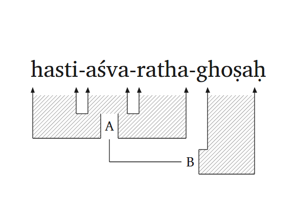

- Files: [SVG](https://github.com/gasyoun/SamasaChakram/blob/main/klammerdiagramm/klammerdiagramm-hastyasvarathaghosah-example.svg) ·
  [embedded-font HTML](https://github.com/gasyoun/SamasaChakram/blob/main/klammerdiagramm/klammerdiagramm-hastyasvarathaghosah-example.html) ·
  [config JSON](https://github.com/gasyoun/SamasaChakram/blob/main/klammerdiagramm/klammerdiagramm-hastyasvarathaghosah.json)
- Analysis: `["A", [0, 1, 2], null, 198]` — the **list child** is the flat dvandva block
  (an N-bar ∪, one band, one label); `["B", "A", 3, 356]` — the head joined right-to-left
  as a mirrored node. Unsandhied segmented members (`hasti-aśva-`, not the fused surface
  `hastyaśva-`); full word form with the visarga.
- What this run built: the **flat dvandva block** (list-child node encoding — coordination
  was previously only drawable as a fake binary chain) and **optional I/II часть** (omit
  `II_START` and no spans are drawn).

## 5 · śīta-uṣṇa-sukha-duḥkha-dāḥ (5 members, a dvandva of dvandvas + tatpuruṣa head)

BG 2.14 — *mātrāsparśās tu kaunteya śītoṣṇasukhaduḥkhadāḥ*: «giving cold-and-heat,
pleasure-and-pain» (v0.1.21, 15-07-2026). The dvandva here is read as **two coordinated
opposite-pairs** (asked; the flat four-member reading of the plain vigraha was the
alternative): pairs **A** = `śīta·uṣṇa` and **B** = `sukha·duḥkha` sit side by side on one
rung, their coordination **C** binds them one rung lower — a dvandva of dvandvas, still
flat at every level, no internal head anywhere — and only then does the upapada head take
the whole block right-to-left: mirrored **D** = `[C] + dāḥ`. **II часть begins at `dāḥ`**
(asked).

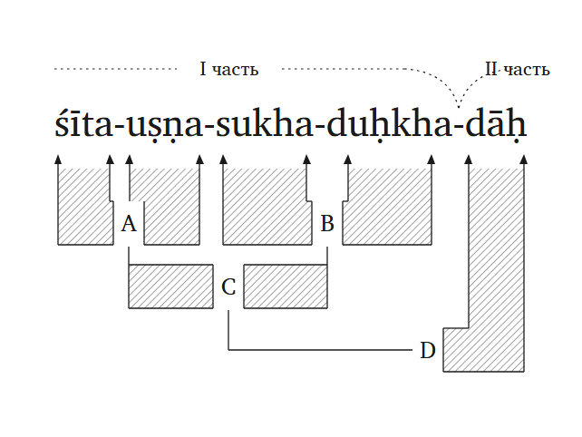

- Files: [SVG](https://github.com/gasyoun/SamasaChakram/blob/main/klammerdiagramm/klammerdiagramm-sitosnasukhaduhkhadah-example.svg) ·
  [embedded-font HTML](https://github.com/gasyoun/SamasaChakram/blob/main/klammerdiagramm/klammerdiagramm-sitosnasukhaduhkhadah-example.html) ·
  [config JSON](https://github.com/gasyoun/SamasaChakram/blob/main/klammerdiagramm/klammerdiagramm-sitosnasukhaduhkhadah.json)
- Analysis: `["A", [0,1], null, 126, 0]` and `["B", [2,3], null, 345, 0]` — sibling flat
  pairs sharing rung 0 via the new optional **level** element; `["C", ["A","B"], null,
  236, 1]` — a flat block whose members are node labels (thin connectors drop from each
  pair's band into the shared coordination band); `["D", "C", 4, 456, 2]` — the head,
  right-to-left. Unsandhied segmented members (`śīta-uṣṇa-`, not the fused `śītoṣṇa-`).
- What this run built: **blocks-of-blocks** (flat-block members may be node labels) and
  **per-node depth levels** (siblings share a rung; without levels the staircase ordering
  stands). Prior examples visually unchanged (the hasti outline refactored into collinear
  segments, same pixels).

## 6 · cakra-pāṇi-caraṇa-kamala-sevā-phalam (6 members, a bahuvrīhi inside)

Bhakti-idiom chain — «the fruit of service to the lotus-feet of the Discus-Handed
(Viṣṇu)» (v0.1.22, 15-07-2026). Two sub-compounds pre-form side by side: the
**bahuvrīhi A** = `cakra+pāṇi` ("whose hand holds the discus" — exocentric in *meaning*
only; per the samāsa-direction ruling it binds right-to-left like any determinative, so it
draws as an ordinary ∪ pair) and the **karmadhāraya B** = `caraṇa+kamala` (the
foot-as-lotus). The **directed join C** = `[A]→[B]` then takes the head right-to-left (the
foot-lotus OF the discus-handed) — a node with no lemma material of its own, thin Y-elbows
to both children. Finally `sevā` and `phalam` accrete as mirrored **D** and **E**.
**II часть begins at `sevā`** (asked): possessor-object block vs action-and-fruit.

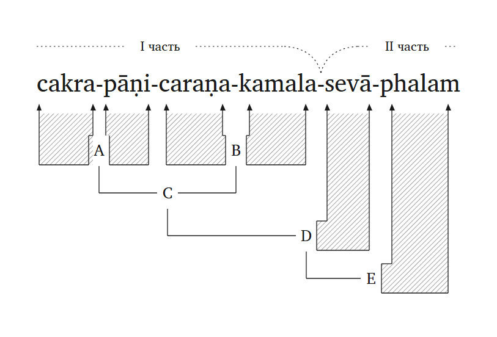

- Files: [SVG](https://github.com/gasyoun/SamasaChakram/blob/main/klammerdiagramm/klammerdiagramm-cakrapanicaranakamalasevaphalam-example.svg) ·
  [embedded-font HTML](https://github.com/gasyoun/SamasaChakram/blob/main/klammerdiagramm/klammerdiagramm-cakrapanicaranakamalasevaphalam-example.html) ·
  [config JSON](https://github.com/gasyoun/SamasaChakram/blob/main/klammerdiagramm/klammerdiagramm-cakrapanicaranakamalasevaphalam.json)
- Analysis: `["A", 0, 1, 146, 0]` and `["B", 2, 3, 370, 0]` — standalone ∪ pairs on one
  rung (two token children + explicit level); `["C", "A", "B", 258, 1]` — the directed
  join (both children node labels, head right); `["D", "C", 4, 485, 2]`,
  `["E", "D", 5, 591, 3]` — mirrored accretions. The nesting was ASKED (two-pairs-then-join
  over the single six-member staircase).
- What this run built: the **directed join node** (composite + composite, thin Y-elbows —
  until now a node always carried its own lemma bar or band) and the **standalone ∪ pair**
  off the deepest slot. Distinct from coordination: a flat list = dvandva (one shared
  band); a string pair = directed bind (head right).

## 7 · śaṅkha-cakra-gadā-pāṇi-caraṇa-kamala-sevā (7 members, all three samāsa kinds)

The capstone mix (v0.1.23, 15-07-2026): dvandva + bahuvrīhi + tatpuruṣa in one word —
«service to the lotus-feet of the Conch-Discus-Mace-Handed», built on the attested Viṣṇu
epithet *śaṅkhacakragadāpāṇiḥ*. The flat **dvandva A** = `śaṅkha·cakra·gadā` (one shared
band, coordinate); mirrored **B** = `[A] + pāṇi` — the **bahuvrīhi** (exocentric in
meaning, right-to-left in structure); standalone **karmadhāraya pair C** =
`caraṇa+kamala`; the **directed join D** = `[B]→[C]` (the foot-lotus OF the possessor);
mirrored **E** = `[D] + sevā`. **II часть begins at `caraṇa`** (asked): the possessor vs
what is served.

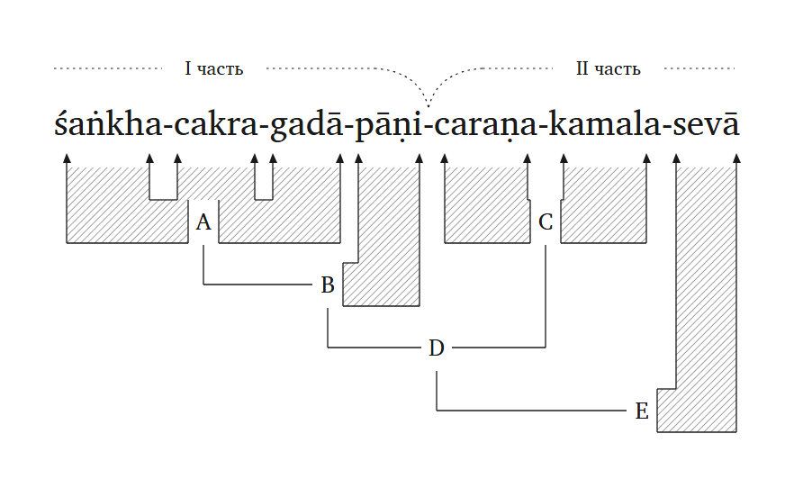

- Files: [SVG](https://github.com/gasyoun/SamasaChakram/blob/main/klammerdiagramm/klammerdiagramm-sankhacakragadapanicaranakamalaseva-example.svg) ·
  [embedded-font HTML](https://github.com/gasyoun/SamasaChakram/blob/main/klammerdiagramm/klammerdiagramm-sankhacakragadapanicaranakamalaseva-example.html) ·
  [config JSON](https://github.com/gasyoun/SamasaChakram/blob/main/klammerdiagramm/klammerdiagramm-sankhacakragadapanicaranakamalaseva.json)
- Analysis: `["A", [0,1,2], null, 210, 0]` · `["C", 4, 5, 590, 0]` · `["B", "A", 3, 348, 1]`
  · `["D", "B", "C", 469, 2]` · `["E", "D", 6, 697, 3]` — every node form the grammar has,
  composed in one config. Nesting ASKED (blocks-pre-form over the single staircase).
- What this run proved: **nothing new had to be built** — the node grammar (chain ·
  mirrored · flat block · blocks-of-blocks · standalone pair · directed join · levels) is
  closed under all three samāsa kinds combined. The seven examples' regression suite came
  back byte-identical.

## 8 · śaṅkha-bherī-nāda-hasti-aśva-ghoṣa-pūrṇa-nagaram (8 members, TWO dvandva blocks)

Epic-style scene compound (v0.1.25, 15-07-2026) — «the city filled with the sound of
conches-and-kettledrums and the din of elephants-and-horses». Two independent dvandva
blocks, each taking its own tatpuruṣa head, the two results coordinated, and the whole
poured into the city: flat **A** = `śaṅkha·bherī` and **C** = `hasti·aśva` (rung 0, both
coordinate); mirrored **B** = `[A]+nāda` and **D** = `[C]+ghoṣa` (rung 1, the two sounds);
**E** = `B·D` — a **dvandva of tatpuruṣas** (rung 2, the blocks-of-blocks band); mirrored
**F** = `[E]+pūrṇa` and **G** = `[F]+nagaram` (rungs 3–4). **II часть begins at `pūrṇa`**
(asked): the sound-coordination vs the filled city.

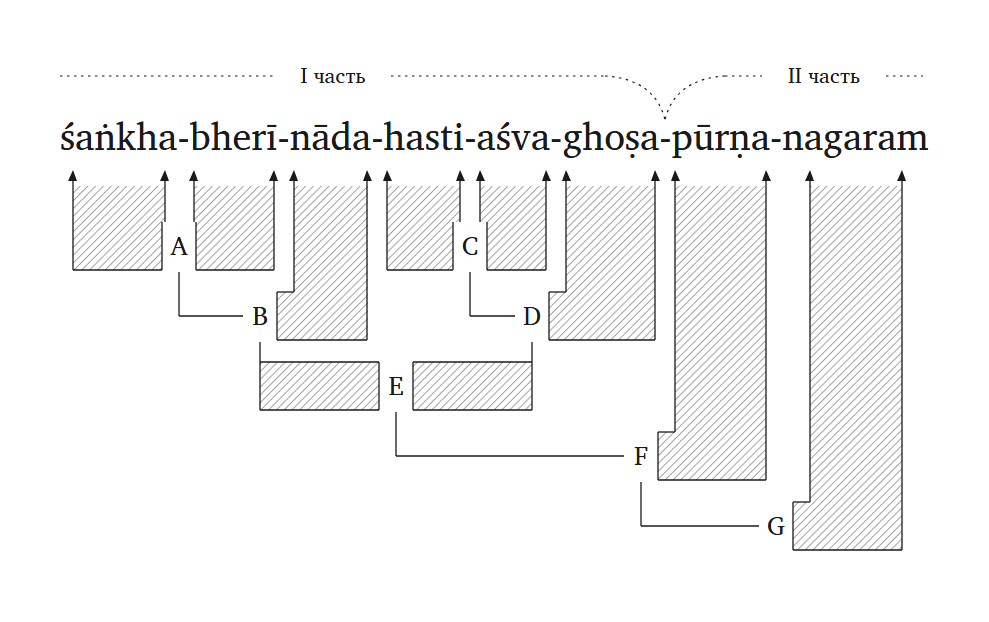

- Files: [SVG](https://github.com/gasyoun/SamasaChakram/blob/main/klammerdiagramm/klammerdiagramm-sankhabherinadahastyasvaghosapurnanagaram-example.svg) ·
  [embedded-font HTML](https://github.com/gasyoun/SamasaChakram/blob/main/klammerdiagramm/klammerdiagramm-sankhabherinadahastyasvaghosapurnanagaram-example.html) ·
  [config JSON](https://github.com/gasyoun/SamasaChakram/blob/main/klammerdiagramm/klammerdiagramm-sankhabherinadahastyasvaghosapurnanagaram.json)
- Analysis: `["A", [0,1], null, 163, 0]` · `["C", [3,4], null, 454, 0]` ·
  `["B", "A", 2, 244, 1]` · `["D", "C", 5, 516, 1]` · `["E", ["B","D"], null, 380, 2]` ·
  `["F", "E", 6, 625, 3]` · `["G", "F", 7, 760, 4]`. Nesting ASKED (two sound-blocks
  coordinated, over the single staircase). Unsandhied segmented members (`hasti-aśva-`,
  not `hastyaśva-`).
- What this run proved: the second consecutive **zero-code composition** — two sibling
  sub-trees of depth 2 (dvandva → tatpuruṣa each) coordinating into a five-rung structure,
  drawn entirely from existing forms. The seven-example regression suite byte-identical.

## 9 · yathā-śakti-datta-anna-pāna-dāna-puṇya-phala-bhāgī (9 members, an avyayībhāva inside)

The run that extended the direction law to its last samāsa kind (v0.1.26, 15-07-2026) —
«sharing in the merit-fruit of the gift of food-and-drink given according to ability».
**MG ruling on the avyayībhāva:** the tradition calls it *pūrvapada-pradhāna* (the avyaya
governs), yet it binds right-to-left like every samāsa — the governing role is semantics,
exactly like the bahuvrīhi's exocentricity; **dvandva remains the sole exception.** So
**A** = `yathā+śakti` draws as an ordinary ∪ pair. Then: mirrored **B** = `[A]+datta`;
flat dvandva **C** = `anna·pāna` with mirrored **D** = `[C]+dāna`; join **E** = `[B]→[D]`
(the gift so given); karmadhāraya pair **F** = `puṇya+phala`; join **G** = `[E]→[F]` (the
merit-fruit of it); head **H** = `[G]+bhāgī`. **II часть begins at `puṇya`** (asked).

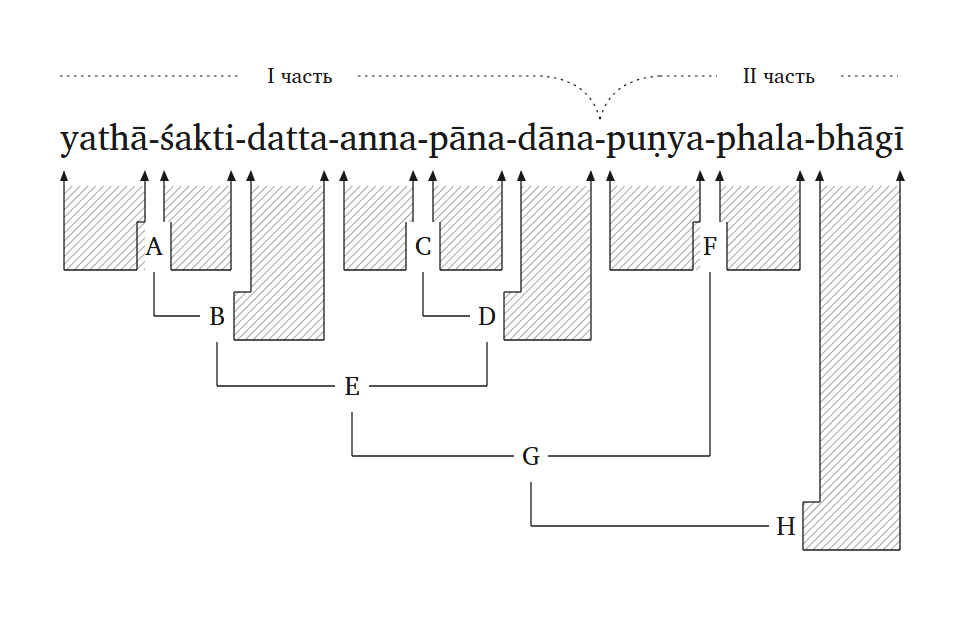

- Files: [SVG](https://github.com/gasyoun/SamasaChakram/blob/main/klammerdiagramm/klammerdiagramm-yathasaktidattannapanadanapunyaphalabhagi-example.svg) ·
  [embedded-font HTML](https://github.com/gasyoun/SamasaChakram/blob/main/klammerdiagramm/klammerdiagramm-yathasaktidattannapanadanapunyaphalabhagi-example.html) ·
  [config JSON](https://github.com/gasyoun/SamasaChakram/blob/main/klammerdiagramm/klammerdiagramm-yathasaktidattannapanadanapunyaphalabhagi.json)
- Analysis: three pre-formed pairs share rung 0 (`["A", 0, 1, 138, 0]` ∪ avyayībhāva ·
  `["C", [3,4], null, 407, 0]` flat dvandva · `["F", 6, 7, 694, 0]` ∪ karmadhāraya);
  mirrored heads on rung 1; two directed joins stack on rungs 2–3; the upapada head closes
  on rung 4. Nesting and II часть ASKED.
- What this run settled: the **avyayībhāva ruling** (recorded in the reference doc and in
  persistent memory — the law is now checked against all five classical kinds: tatpuruṣa,
  karmadhāraya, bahuvrīhi, avyayībhāva right-to-left; dvandva flat). Third consecutive
  zero-code composition; eight-example regression suite byte-identical.

## 10 · yathā-vidhi-gandha-puṣpa-nīla-kaṇṭha-pāda-padma-pūjā-phalam (10 members, ALL FIVE kinds)

The series capstone (v0.1.27, 15-07-2026) — «the fruit of the worship, performed according
to rule with incense-and-flowers, of the lotus-feet of the Blue-Throated (Śiva)» — every
classical samāsa kind in one word, each drawn by its ruled form:

| Kind | Node | Form |
|---|---|---|
| avyayībhāva | **A** = `yathā+vidhi` | ∪ pair, right-to-left (§9 ruling) |
| dvandva | **B** = `gandha·puṣpa` | flat band — the sole exception |
| bahuvrīhi | **C** = `nīla+kaṇṭha` | ∪ pair (exocentricity = semantics) |
| karmadhāraya | **D** = `pāda+padma` | ∪ pair |
| tatpuruṣa | **E–I** | the whole right-to-left spine |

The spine: **E** = `[C]→[D]` (the foot-lotus OF the Blue-Throated), **F** = `[E]+pūjā`,
**G** = `[B]→[F]` (worship WITH the offerings), **H** = `[A]→[G]` (performed
according-to-rule), **I** = `[H]+phalam`. **II часть begins at `nīla`** (asked): the
manner-and-offering block vs the deity, worship and fruit.

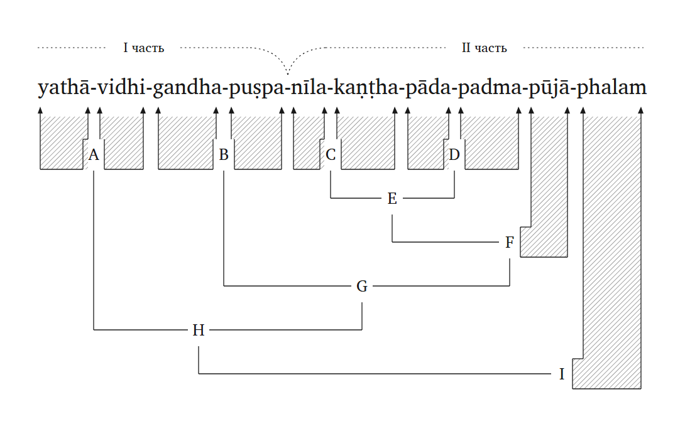

- Files: [SVG](https://github.com/gasyoun/SamasaChakram/blob/main/klammerdiagramm/klammerdiagramm-yathavidhigandhapuspanilakanthapadapadmapujaphalam-example.svg) ·
  [embedded-font HTML](https://github.com/gasyoun/SamasaChakram/blob/main/klammerdiagramm/klammerdiagramm-yathavidhigandhapuspanilakanthapadapadmapujaphalam-example.html) ·
  [config JSON](https://github.com/gasyoun/SamasaChakram/blob/main/klammerdiagramm/klammerdiagramm-yathavidhigandhapuspanilakanthapadapadmapujaphalam.json)
- Analysis: four pairs on rung 0, five stacked binds on rungs 1–5 (six-rung diagram, the
  deepest structure yet). Nesting and II часть ASKED per contract.
- What this run proved: the **fourth consecutive zero-code composition**, now over the
  complete five-kind typology at once — the seven drawing forms (chain · mirrored · flat
  block · blocks-of-blocks · standalone pair · directed join · levels) are sufficient for
  the classical samāsa system in any mix.

## 11 · śāka-[priya]-pārthivaḥ (madhyamapadalopin — the ghost-member notation)

Built by MG's vote **D4** (16-07-2026, H982 crosswalk: «одной только сноски недостаточно» —
the first apply pass had mis-read the vote as footnote-only; corrected same day). Leitan's
example *śākapārthivaḥ* (vigraha: *śākapriyaḥ pārthivaḥ* — «царь-любитель овощей»): the
elided middle member is **restored in the word line in editorial brackets** — `[priya]` —
measured into the run but carrying **no bar, no arrows, no node index**; node **A** joins
the two real members. I/II часть spans omitted (notation demo).

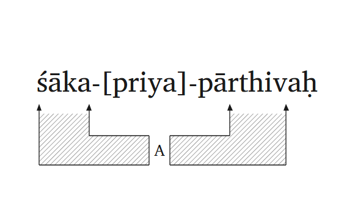

- Files: [SVG](https://github.com/gasyoun/SamasaChakram/blob/main/klammerdiagramm/klammerdiagramm-sakapriyaparthivah-example.svg) ·
  [embedded-font HTML](https://github.com/gasyoun/SamasaChakram/blob/main/klammerdiagramm/klammerdiagramm-sakapriyaparthivah-example.html) ·
  [config JSON](https://github.com/gasyoun/SamasaChakram/blob/main/klammerdiagramm/klammerdiagramm-sakapriyaparthivah.json)
- Encoding: `"ghosts": [{"after": 0, "text": "priya"}]` — tight-run only.
- What this run fixed en passant: the ∪-band stretch between a mid-gap label and the
  right member's bar had gone unhatched since v0.1.14 (invisible while every label sat
  near its bar) — the ghost demo exposed it; the fix retro-filled the same hole in four
  committed renders (uddāma-Leitan, cakrapāṇi…, śaṅkhacakra…, yat-pāda…), hatch-only diffs.

## Adding the next compound

1. Copy [klammerdiagramm-abhijnanasakuntalam.json](https://github.com/gasyoun/SamasaChakram/blob/main/klammerdiagramm/klammerdiagramm-abhijnanasakuntalam.json)
   (or, for a left-nested compound,
   [klammerdiagramm-rajarsivamsah.json](https://github.com/gasyoun/SamasaChakram/blob/main/klammerdiagramm/klammerdiagramm-rajarsivamsah.json))
   as the template: swap `tokens` (IAST, left→right, unsandhied segmented members),
   rewrite `nodes` deepest-first (right-branching by default — confirm with the user when
   the analysis is ambiguous; name a composite child by its node label to mirror the
   bracket), and **ask** which member begins II часть.
2. `python build_klammerdiagramm.py --config <json> --out <name>` → `<name>.svg` +
   `<name>.html`; eyeball the headless render, nudge per-node `label_x` if needed.
3. Commit the trio (config + SVG + HTML) and add its section here.

_Dr. Mārcis Gasūns_
